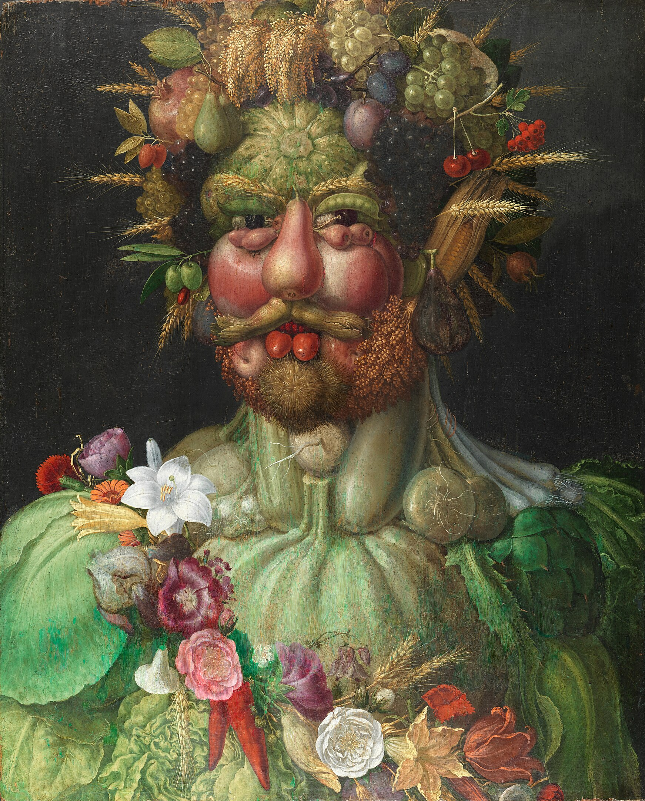
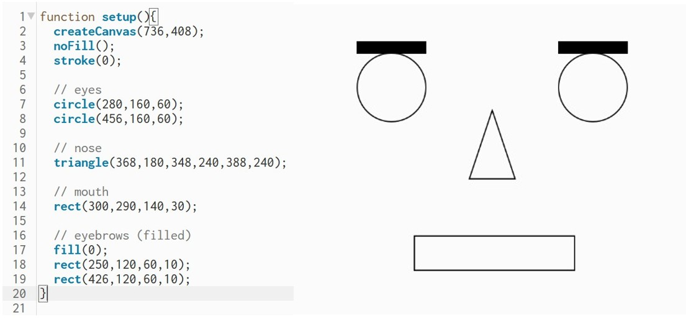

# Final Project - Botanic Visage

The main idea for Botanic Visage, is to be able to sucessfully generate a recognisable face with individual fruits, vegetables and flowers. Firstly we will try to create this, using simple algorithms to define the position of the main characteristics of the face. If this is sucessfull we will then try to capture the face of the user and recreate it with the botanic algirthm.

The inspiration for this are the famous oil pantings from the 16th century, below an example can be found of Vertumnus (Arcimboldo). 

The following document will track the research, progress, iterations and evolution of Botaninc Visage.

First we need to understand how Arcimboldo made his oil paintings. His process was the following:

 He would roughthly sketch out the outline of the face and upper body. Then he would pre-select which furits and vegetables looked like facial parts, so that he would have a recognisable pattern. Then one by one he would start drawing them, compartimentalising parts of the face to individually turn them into greenery, and filling the empty space with a new fruit or vegetable. 

 Our first step is to be able get P5.js to manage to spawn certain images in specific places on the canvas. Here we will us triangles as a nose, circles for the eyes and rectangles for the mouth.

  

  

