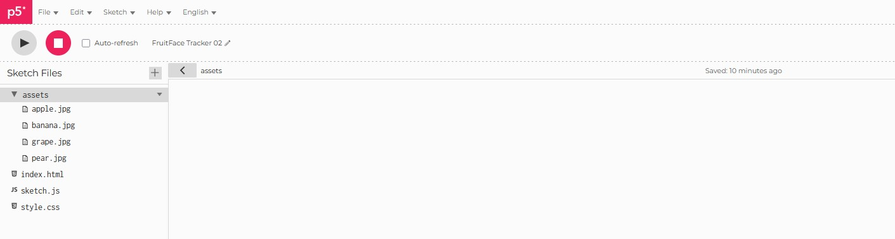

# Final Project - Botanic Visage

The main idea for Botanic Visage, is to be able to sucessfully generate a recognisable face with individual fruits, vegetables and flowers. Firstly we will try to create this, using simple algorithms to define the position of the main characteristics of the face. If this is sucessfull we will then try to capture the face of the user and recreate it with the botanic algirthm.

The inspiration for this are the famous oil pantings from the 16th century, below an example can be found of Vertumnus (Arcimboldo). 

The following document will track the research, progress, iterations and evolution of Botaninc Visage.

First we need to understand how Arcimboldo made his oil paintings. His process was the following:

He would roughthly sketch out the outline of the face and upper body. Then he would pre-select which furits and vegetables looked like facial parts, so that he would have a recognisable pattern. Then one by one he would start drawing them, compartimentalising parts of the face to individually turn them into greenery, and filling the empty space with a new fruit or vegetable. 

Our first step is to be able get P5.js to manage to generate certain simple shapes in specific places on the canvas. Here we will us triangles as a nose, circles for the eyes and rectangles for the mouth.

The next step is turning those specifc geometric shapes into fruits. Many attempts were made trying to link the photo's to wikepiedia's image library when creating the variables for them. But all those attemps did not bear their fruit...literally.
Therefore the next logical step was to become familliar with th P5.js web editor. This is when I explored the edtor and encountered the sketch flies in the editor. I thought that extent of j5.ps was the coding window of sketch.js. So naturally I found the possibility of adding as asset pack with jpg images i could fetch with function preload().  

Once the assets folder was all setup properly, we could now call these images to remplace the simple shapes with images. With a little contourage of the face to bring it to life. Below is Protoype #1 of "FruitFace". 


<iframe src="https://editor.p5js.org/matthew.brker.404/full/UiWZ6RaDA" width="100%" height="450" frameborder="no"></iframe>


Finally we have a working prototype that is starting to ressemeble the masterpiece of Arcimboldo. First thing to do is tweak the overkill of fruits used of the eyebrows and mouth. 


<iframe src="https://editor.p5js.org/matthew.brker.404/full/6sKlWH1x8" width="100%" height="450" frameborder="no"></iframe>
